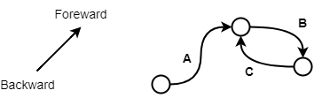

# T2 CG 
### Leonardo S. e Morgana Weber

## Controles
* **ESC**: fecha a aplicação
* **ESPAÇO**: para o carro
* **R**: reinicia o programa
* **A**: escolhe a próxima curva no sentido antihorário
* **D**: escolhe a próxima curva no sentido horário
* **W**: move o carro para frente, caso ele esteja parado
* **S**: move o carro para trás, caso ele esteja parado

## Modelagem

#### Ruas
Para *f(x)* sendo a função de curva bèzier, o primeiro ponto é o sentido backward e o último é o sentido foreward, onde *f(x)* = ponto inicial e *f(x)* = ponto final. logo uma velocidade positiva vai do 0 ao 1 e uma negativa do 1 ao 0.

#### Conexões
Cada rua possui duas listas de ruas conectadas, tanto do sentido foreward da curva quando no backward. Como existem casos como o C possuindo a conexão A entre ponto foreward C e foreward A, precisamos de uma maneira de aplicar um viés na rua, multiplicando sua posição e velocidades por -1 caso a conexão não for no sentido convencional (backward para backward e foreward para foreward) 

#### Carro
O carro possui referência para a curva que ele está (`Car.road`), usado para calcular sua posição global e rotação baseado na fração que se encontra da curva (`Car.position`) e uma referência para a próxima curva (`Car.next`), calculado após ultrapassar a metade da curva.

### Colisão
Cada rua tem um Set de carros (`Road.cars`) iminigos presente nela, assim com base no atributo de posição absoluta na curva (`Car.length`), verifica se a distância entre o player e todos os inimigos na curva e pequena o suficiente para ser considerada uma colisão.

---
## Tasks
#### Rua
* [leo e morg] [done] Ler arquivo de definição de curvas
* [leo] [done] Instanciar ruas com base no arquivo de curvas
* [morg] Obter bounding box de curva bezier (não é tão simples como no políono) e calcular o máximo e mínimo para dar um tamanho para tela
* [morg] Estrutura de ruas no arquivo para conter 30 ruas, sendo 8 bifurcações, 8 trifurcações e o resto de conexões + ou - né, não precisa ser tão louco nisso

#### Carro
* [leo] [done] Modelar classe carro com curva que ele se encontra, posição na curva, direção (do primeiro ponto ao último ou ao contrário, podemos chamar de cima baixo) e tipo do carro (player ou I.A)
* [leo] [done] Método para desenhar o carro (pensei em ser um triagulo simples), o carro se encontra no ponto x da curva com a rotação na tangente da curva (mds que complicado, acho que precisa derivar) e apontando para direção y
* [leo] [done] Método para o carro se mover, em velocidade constante podendo ir para frente ou para tras, sincronizando a sua  dreção
* [leo] [done] Estrutura e lógica para descrever conexões
* [leo] [done] Decisão de próxima curva, é aleatório e é decidido ao carro chegar no meio da curva, precisando de mais um método para definir o que é o meio da curva e ao ter a curva decidida, pintar ela caso for o carro do jogador
* [leo] [done] colorir próxima curva escolhida pelo jogador
* [leo] [done] Controles de usuário, espaço para parar e mover, outra tecla para trocar de curva escolhida

#### Enemies
* [leo] [done] maneira de gerar iminigos, renderizar e mover
* [leo] [done] checkar por colisões
* [morg] tela de game over e reiniciar

#### Other
* [morg] [done] material, setup e exemplos
* [leo e morg] testar bastante
* [leo e morg] documentar
* [?] reiniciar o programa na tecla R